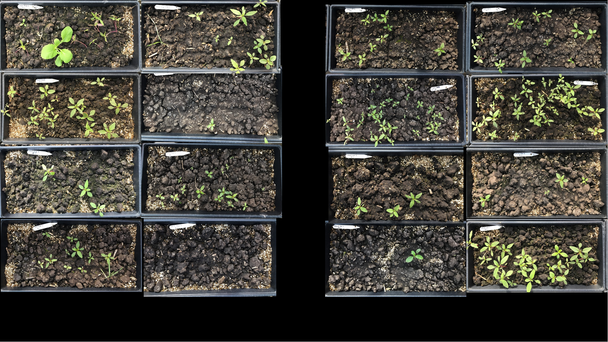

# Effects of long-term cover cropping on weed seedbanks 

Analyses supporting the publication [Effects of long-term cover cropping
on weed seedbanks](doi:%2010.3389/fagro.2020.591091). The analyses rely
on data provided as an R package available in [this
repository](https://github.com/vanichols/PFIweeds2020) or as CSVs
through [Iowa State University’s DataShare
service](https://doi.org/10.25380/iastate.12762011.v1).

