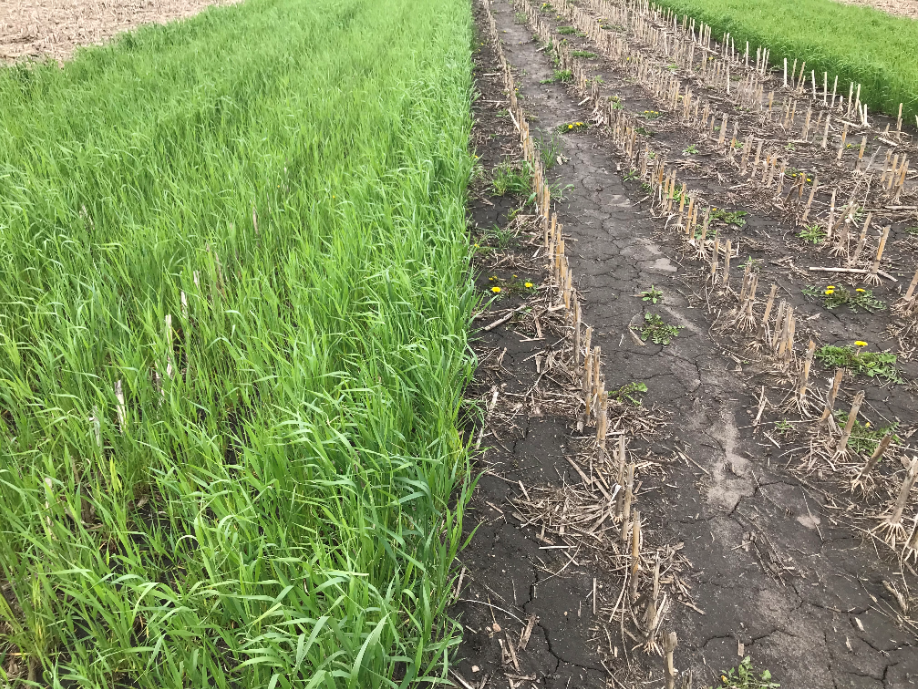
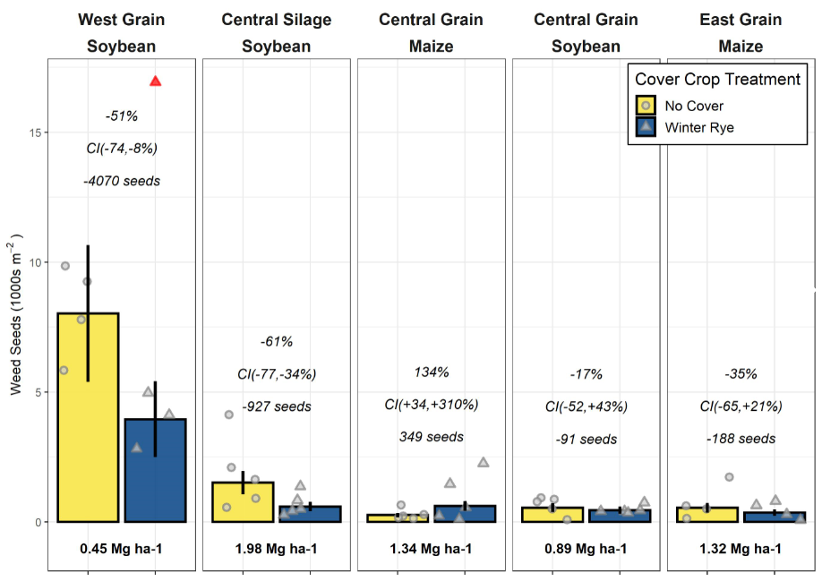
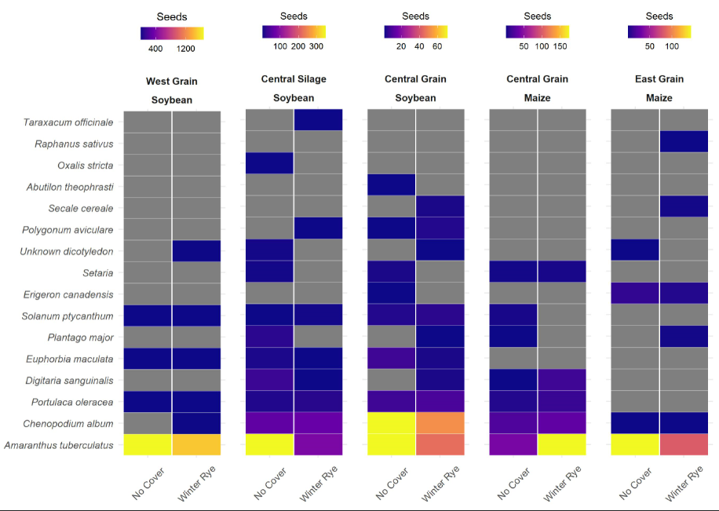

# Effects of long-term cover cropping on weed seedbanks

Analyses supporting the publication [Effects of long-term cover cropping
on weed
seedbanks](https://www.frontiersin.org/articles/10.3389/fagro.2020.591091/abstract).
The analyses rely on data provided as an R package available in [this
repository](https://github.com/vanichols/PFIweeds2020) or as CSVs
through [Iowa State University’s DataShare
service](https://doi.org/10.25380/iastate.12762011.v1). A fun
walk-through of the statistical models we explored is also available on
[Lydia English’s website](https://lydiae.com/2020/04/22/many-models/).

